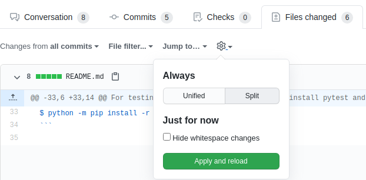
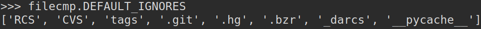

# Web App Best Practices and Tests Parametrization

**[10th Online Meeting](https://www.youtube.com/watch?v=Hs-HJ56572g&list=PLFt-PM7J_H3EU5Oez3ZSVjY5pZJttP2lT&index=11&t=3154s&ab_channel=encukou), September 7, 2020**

***Mentor: Petr Viktorin***

## Checking New PRs

*TO-DO*

1. Remove excess images, and improve quality of some images from blog9.
2. Issue#54 - continue improving the blog app
      - The "MDconvert/__init__.py" was removed from the blog app)
      - **Homework notes** at 00hr:42mins
      - **Note on Flask security**  at 00hr:47mins   
3. Add install mistune to readme or requirements

### Web Application Best Practices

*DONE*

1. When running the blog app we got FileNotFoundError: [Errno 2] No such file or directory: 'content/articles/lekce6.md'
    - The problem was in the app.route to '/lekce6' since the Path('content/articles/lekce6.md') limits the app to be run from a single location/folder.
    - **Run a web app from any location/Path/folder**, 00hr:14min,  we created a base path determined only by the location of app.py:

                ```python
                base_path = Path(__file__).parent
                ```
2. **Creating a dynamic route (generic route for all posts)** - added a ```'/<slug>''``` parameter (slug is a tech-term referring to the last peace of an address/Path):

                ```python
                @app.route('/<slug>')
                def post(slug):
                   md_file = base_url / Path('content/articles/{slug}.md')
                ```
      - Changed the url_for in the index page accordingly.

3. **When a nonexistent page is requested in the URL** - except FileNotFoundError as 404 not found:

                ```python
              except FileNotFoundError:
                  abort(404)
                ```
4. **Shorten code in the 'try' block:**

                ```python
                try:
                  with open(md_file, mode='r', encoding='UTF-8') as f:
                    md_content = f.read()
                except FileNotFoundError:
                  abort(404)
                ```
    Improved into:

                ```python
                  try:
                    file = open(md_file, mode='r', encoding='UTF-8')
                  except FileNotFoundError:
                    abort(404)
                  with file:
                     md_content = f.read()
                ```
5. **Note on security** 00hr:46min - users should not be able to input paths into the URL
      - Flask takes care of this in its [variable rules](https://flask.palletsprojects.com/en/1.1.x/quickstart/?highlight=variable%20rules) by escaping any slashes within strings. This will prevent strings to contain file system paths.
      - When creating <html> templates use the safe filter, ```{{text | safe}}``` which is a way to tell Flask that this text is safe so it can omit the variable rules on that specific instance. Otherwise, Flask will convert the html code into regular text, and the page will not render properly.

6. **Adding new posts** 00hr:33min
      - Separate all html code in a templates folder and add template-path to main route.
      - Add render_template to Flask and adapt html code accordingly
      - Added a [list of 'post_names' to the index page route](https://github.com/encukou/freezeyt/blob/291cacf672b9c6f56abe57eabc4eb36663b74436/freezeyt_blog/app.py#L15) and use the same in the 'index.html' by [embedding a python 'for' loop in the html](https://github.com/encukou/freezeyt/blob/291cacf672b9c6f56abe57eabc4eb36663b74436/freezeyt_blog/templates/index.html#L11-L14) to avoid repetition.

### Test Parametrization PR - [Issue#51](https://github.com/encukou/freezeyt/pull/51)
00hr:52min

1. In the first commit, MODULE_NAMES is generated from the 'fixtures' folder and than used as a parameter in ```test_output(tmp_path, module_name)```:

    ```python
    FIXTURES_PATH = Path(__file__).parent / 'fixtures'
    MODULE_NAMES = [p.stem for p in FIXTURES_PATH.iterdir() if p.is_file()]

    @pytest.mark.parametrize('module_name', MODULE_NAMES)
    def test_output(tmp_path, module_name):
    ```

2. In the second commit, the expected output/all demo_apps are added for testing. This adds automatically generated files, and it's useful to explain the way you did this in the commit description.
      - Ex. Tests were run from environmental variable 'TEST_CREATE_EXPECTED_OUTPUT' which stores the expected output.

3. Modifying ```test_expected_output``` so that it passes - solved by raising a ValueError when freezing ```demo_app_broken_link```. This means that an if statement was added and the rest stayed as is except that it was indented. To make sure the only change was the indentation:
      - **Github Tip** 01hr:00min - to see all changes in a pull request **excluding white spaces**: under the 'Files changed' tab > settings > check-mark - 'Hide whitespace changes' or delete the 'w=1' at the end of the URL in the browser

      

4. Comparing directory trees - the issue when comparing to an empty directory. **GIT does not add empty folders** 01hr:5min

      - Simplest way is to add one extra file to all sub-directories to just get past this issue.
      - Considering [```filecmp.DEFAULT_IGNORES```](https://docs.python.org/3/library/filecmp.html#the-dircmp-class) can hide files which we might need, and the fact that we want our Freezeyt 'comparator' to be able to generate Git folders, it is important to [set it up in a way that it does not ignore any files](https://github.com/encukou/freezeyt/blob/d9e59f0d29d72a2e1ac1375e5fe96c5858fd44c9/tests/test_expected_output.py#L47).

      

      - In order to test this, a RCS folder (filecmp ignores all folders named RCS), was added to the test data, and test file3.txt was added to all sub-directories in fixtures and testdir:

        

5. Adding more apps which can not be frozen, similar to "demo_app_broken_link":
01hr:17min

      ```python
      if module_name == "demo_app_broken_link":
        with pytest.raises(ValueError):
          freeze(app, tmp_path)
      ```
      - Check if the app fails freezing or not by [checking if there is an output folder](https://github.com/encukou/freezeyt/blob/d9e59f0d29d72a2e1ac1375e5fe96c5858fd44c9/tests/test_expected_output.py#L26-L32) for the same.

### How to get rid of duplicate apps in Freezyt
At this point one copy is in the fixtures folder and another one is in the main folder, and if one is deleted, test_demo_app fails due to a module_name error since Python searches for it in the deleted folder.
This happens because python does not know to search and import the requested module from the correct location, and we want the path to all apps to be the fixtures folder.

## Searching for and importing modules
01hr:24min


**Built-in modules are not imported from a specific file, so python does not need a path to get to them.**
Asside from built_in modules, all others are imported from a python variable named "Path" saved under ```sys.path``` which is a list of all directories from which you can import:

```python
/usr/lib64/python38.zip
/usr/lib64/python3.8
/usr/lib64/python3.8/lib-dynload
/home/user/python_2020/pyladiesweb/projekt/venv/lib64/python3.8/site-packages
/home/user/python_2020/pyladiesweb/projekt/venv/lib/python3.8/site-packages
```
The first item in this list is an empty string which represents the current directory. When we import something from python, it iterates through the whole list until it finds the requested module:
```python
>>> sys.path
['', '/usr/lib64/python38.zip', '/usr/lib64/python3.8', '/usr/lib64/python3.8/lib-dynload', '/home/user/python_2020/pyladiesweb/projekt/venv/lib64/python3.8/site-packages', '/home/user/python_2020/pyladiesweb/projekt/venv/lib/python3.8/site-packages']
```

### How is the ```__path__``` created
- **The __path__ attribute can be created manually** 01hr:32min.
- Otherwise, Python can set the path where modules are imported from automatically. In a package with an ```__init__.py``` file in one of it's folders, Python automatically sets the ```__path__``` to the folder which contains the ```__init__.py``` file.
- **To go deeper with Modules and Packages check out [David M. Beazley's workshop](http://www.dabeaz.com/modulepackage/)**

### Adding the ```__path__``` to the fixtures folder to the ```sys.path``` list:
01hr:41min

When test_expected_output needs to import a module it should search for it in the fixtures folder. This requires to import the sys module and to ```sys.path.append(str(FIXTURES_PATH))```. The issue with this is that it appends the path for every test, and creates a mess in the sys.path as the same path is just appended a few times:


The solution is to create another orig_path variable to record the original sys.path, and put the test_output inside a ```try``` block. Once the test is finished return the sys.path to it's original state before the test.

```python
@pytest.mark.parametrize('module_name', MODULE_NAMES)
def test_output(tmp_path, module_name):
  orig_path = sys.path
  try:
    sys.path.append(str(FIXTURES_PATH))
    module = importlib.import_module(module_name)
    app = module.app

    expected = Path(__file__).parent / 'fixture' / module_name

    if not expected.exists():
      with pytest.raises(ValueError):
        freeze(app, tmp_path)
    else:
      freeze(app, tmp_path)

      if not expected.exists():
        if 'TEST_CREATE_EXPECTED_OUTPUT' in os.environ:
          shutil.copytree(tmp_path, expected)
        else:
          raise AssertionError(
            f'Expected output directory ({expected}) does not exist.
            + f'Run with TEST_CREATE_EXPECTED_OUTPUT=1 to create it'
          )
      assert_dirs_same(tmp_path, expected)
  finally:
    sys.path = orig_path
```

**Monkey_patch** 01hr:50min...
