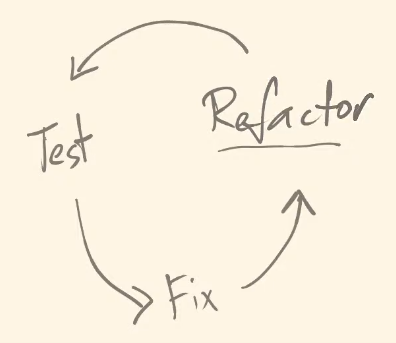
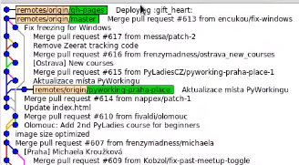
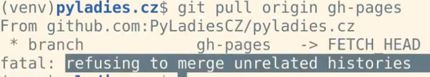
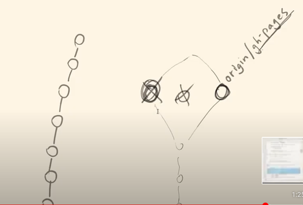
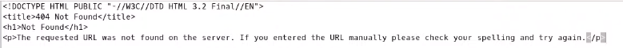
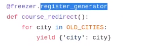

# The First Attempt to Freeze

**[6th Online Meeting](https://www.youtube.com/watch?v=ycEkUs_rm4Y&feature=youtu.be), August 10, 2020**

***Mentor: Petr Viktorin***


## [Overview](https://www.youtube.com/watch?v=ycEkUs_rm4Y&feature=youtu.be)
- [00:04min](#Issue#27) - Issue#27: [Handling relative links correctly](https://github.com/encukou/freezeyt/commit/36bd13b4de3900cf356e4cd079ee7a06802be99b) - [according to test_structured](https://github.com/encukou/freezeyt/blob/master/test_demo.py)
- [00:18min](#Tests-still-failing) - Failing tests after the changes
- [00:22min](#Test-Driven-Development) - Test Driven Development and Refactoring
- [00:34min](#Freezing-pyladies.cz) - Freezing pyladies.cz
- [00:42min](#First-result-from-our-freezeyt) - First results from our first freeze
- [00:49min](#The-Missing-Images) - Missing images, first issue with the first freeze
- [01hr:00min](#How-can-we-be-sure-that-the-frozen) - Make sure the frozen website looks exactly as intended
- [01hr:12min](#The-Issue-with-Elsa's-Commits) - The issue with the way Elsa commits
- [01hr:17min](#Issue#31) - Broken links
- [01hr:31min](#Issue#32) - Recognizing page redirections
- [01hr:35min](#Issue#33) - Recognizing CSS styles
- [01hr:42min](#Good-Future-Issues) - Good Future Issues
- [01hr:46min](#Issue#34) - Add the possibility to generate additional files as ```CNAME``` and ```.nojekyl```

### Issue#27:
*4th minute*

[Handle relative links correctly](https://github.com/encukou/freezeyt/commit/36bd13b4de3900cf356e4cd079ee7a06802be99b) - [according to test_structured](https://github.com/encukou/freezeyt/blob/master/test_demo.py) which tests on [demo_app_structured.py](https://github.com/encukou/freezeyt/blob/master/demo_app_structured.py):
```python
def test_structured(tmp_path):
    """Test if an app with relative URLs works.
    """

    freeze(app_structured, tmp_path)

    path1 = tmp_path / "index.html"
    path2 = tmp_path / "users/index.html"
    path3 = tmp_path / "users/a/index.html"
    path4 = tmp_path / "users/b/index.html"

    path_not_exists = tmp_path / "users/c/index.html"

    assert path1.exists()
    assert path2.exists()
    assert path3.exists()
    assert path4.exists()

    assert not path_not_exists.exists()
```
This [demo_app_structured](https://github.com/encukou/freezeyt/blob/master/demo_app_structured.py) includes a page which has a slightly more complicated path starting with a folder ```'/users/'``` which branches out to two other sub-pages, for user A and user B. At the moment Freezyt recognizes this route as an absolute path, and leads to route ```'/a/'``` instead of ```'/users/a/'```.
Until this point the ```url_to_filename()``` function would take both absolute and relative URLs as arguments. The solution for issue#27 was to always make an absolute path out of any relative link/path received as an argument. To solve this we need to add the base (*scheme* and *netloc* attributes) to the link/path to make an absolute path out of the relative.
For example:
The freeze() function takes two parameters, base and url:
- If on page (base): http://localhost:8000/users/
- On it is a link (url): a/
- we need to make the following out of this:
http://localhost:8000/users/a/

The best way to do this is using the ```urljoin``` method, which joins the base address and the rest of the URL. To start off with an absolute address, a full_url was added to links in the freeze function instead of just '/':
```python
links = ['http://localhost:8000/']
```
Next we needed to make sure we also get full_urls in the visited links as well. The *visited_links* list is populated with new links from the ```get_all_links()``` function which is why it was necesary for this function to also return absolute urls. This way we made sure that we prepend the full address to the *links* and *visited_links* lists. In this way we are always working with absolute URLs.
The changes made to ```get_all_links()``` and ```get_links_from_node()``` (the addition of a base_url argument and the ```urljoin``` method) are visible bellow:
```python
-def get_all_links(page_content: bytes) -> list:
+def get_all_links(page_content: bytes, base_url) -> list:
     """Get all links from "page_content".

     Return an iterable of strings.
+
+    base_url is the URL of the page.
     """
     document = html5lib.parse(page_content)
-    return get_links_from_node(document)
+    return get_links_from_node(document, base_url)

-def get_links_from_node(node: xml.dom.minidom.Node) -> list:
+def get_links_from_node(node: xml.dom.minidom.Node, base_url) -> list:
     """Get all links from xml.dom.minidom Node."""
     result = []
     if 'href' in node.attrib:
-        result.append(node.attrib['href'])
+        href = node.attrib['href']
+        full_url = urljoin(base_url, href)
+        result.append(full_url)
     for child in node:
-        result.extend(get_links_from_node(child))
+        result.extend(get_links_from_node(child, base_url))
     return result
```
Consequently, we needed to add an argument (base_url) to the [test_get_links.py](https://github.com/encukou/freezeyt/blob/master/test_get_links.py) since it calls the get_all_links() function where we added the base_url argument.
Furthermore, to test the new 'relative links' feature of the ```get_all_links()``` function a relative link ```<a href='fourth_page/'>LINK</a>``` was added to the test as well.
In case ```get_all_links()``` was called with a path like 'http://localhost:8000/path1/path2/' the relative link should also link to it, so a new ```test_get_links_path()``` was added.
```python
def test_get_links_path():
    links = get_all_links(b"""
        <html>
            <head>
                <title>Hello world</title>
            </head>
            <body>
                Hello world!
                <br>
                <a href='/second_page'>LINK</a> to second page.
                <p>
                    <a href='/third_page'>LINK</a> to third page.
                </p>
                <a href='fourth_page/'>LINK</a> to third page.
            </body>
        </html>
    """, 'http://localhost:8000/path1/path2/')

    assert sorted(links) == [
        'http://localhost:8000/path1/path2/fourth_page/',
        'http://localhost:8000/second_page',
        'http://localhost:8000/third_page',
```
This test ensures (*asserts*) that when given an absolute link, nothing will change:
```python
'http://localhost:8000/second_page',
'http://localhost:8000/third_page',
```
And when given a relative link (ex. 'fourth_page/'), the base appends the relative link:
```python
'http://localhost:8000/path1/path2/fourth_page/
```
To get a clearer picture as to why and how this happens, here is how the ```url_to_filename()``` function looks like at the moment:
```python
def url_to_filename(base, url):
    """Return the filename to which the page is frozen.
    Parameters:
    base - Filesystem base path (eg. /tmp/)
    url - Absolute URL (eg. http://localhost:8000/second.html)
    """
    url_parse = urlparse(url)

    if not url_parse.scheme:
        raise ValueError("Need an absolute URL")
    if url_parse.scheme not in ('http', 'https'):
        raise ValueError("got URL that is not http")

    if url_parse.netloc == '':
        raise ValueError("Need an absolute URL")

    if url_parse.netloc == 'localhost:8000':
        url_path = url_parse.path
    else:
        raise ValueError("got external URL instead of localhost")

    if url_path.endswith('/'):
        url_path = url_path + 'index.html'

    return base / url_path.lstrip('/')
```
### Tests still failing
*18th min*

After the aforementioned changes, most tests were failing and the reason was that in the ```freeze()``` function we changed the links into absolute links only:
```python
-    links = ['/']
+    links = ['http://localhost:8000/']
```
More precisely, these links are used as the value for the ```'PATH_INFO'``` in the ```environ``` dictionary. According to the general structure of an URL ```scheme://netloc/path```, 'path' is what comes after the base address/netloc. This was easily changed by entering the following before the environ:
```python
+ path_info = urlparse(link).path
+ print('path_info:', path_info)

         environ = {
             'SERVER_NAME': 'localhost',
             'wsgi.url_scheme': 'http',
             'SERVER_PORT': '8000',
             'REQUEST_METHOD': 'GET',
-            'PATH_INFO': link,
+            'PATH_INFO': path_info,
```
### Test Driven Development - Refactoring
*22nd min*



- Some variable names changed for clarity in the code. Changed 'link' to 'url' because it is a full address now, and 'new_urls' instead of 'links' since these are yet to go through the while loop check.
- Another *ValueError* is raised in the ```url_to_file_name()``` function in case the url received did not contain a *'scheme'* (ie. was not an absolute url).
- The same thing happens in case there is no *'netloc'* in the received url.
- Reorganized the tests and fixed some of the URLs used in the tests since we changed all relative URLs to absolute ones.
- ```test_relative()``` was added to the [test_url_to_filename](https://github.com/encukou/freezeyt/blob/master/test_url_to_filename.py):
```python
def test_relative():
    with pytest.raises(ValueError):
        url_to_filename(base, "/a/b/c")
```

## Freezing pyladies.cz
*34th minute*

In order to freeze pyladies.cz we started with the documentation in the README file [Usage](https://github.com/PyLadiesCZ/pyladies.cz/blob/master/README.md).
After cloning both [freezeyt](https://github.com/encukou/freezeyt) and [pyladies.cz](https://github.com/PyLadiesCZ/pyladies.cz) we needed to find a way to import both files [pyladies_cz.py](https://github.com/PyLadiesCZ/pyladies.cz/blob/master/pyladies_cz.py) and [freezing.py](https://github.com/encukou/freezeyt/blob/master/freezeyt/freezing.py)  since they reside in different folders.
The first option, suitable for this first attempt is to set up an environmental variable PYTHONPATH:
```python
$ export PYTHONPATH= /home/user/freezeyt (on linux)  
```
or
```python
set PYTHONPATH= ../freezeyt (on windows)
```
*(""/home/user/"" is the absolute path where you cloned your freezyet repository. Adjust according to your system)*

The second option, is to install freezeyt into the virtual environment and in the same folder with the application that we are freezing. This is a future enhancement.

Now you can import both freezeyt and pyladies_cz and start freezeyt:

```
$ python -m freezeyt --help
```

Loading freezeyt as a module will likely fail because of missing pyladies_cz. To overcome this, we needed to create the _build folder to store the frozen content:
```
$ mkdir _build
$ python -m freezeyt pyladies_cz _build
```

Moving forward, we had to satisfy the requirements for missing libraries, which are part of the pyladies_cz code (ex. flask_frozen). These Python dependencies are included in the [requirements.txt](https://github.com/PyLadiesCZ/pyladies.cz) file under the pyladies repository. We installed them in the same venv:
```
$ python -m pip install -r requirements.txt
```
Next start freezeyt again:
```
$ python -m freezeyt pyladies_cz _build
```
If there are any other missing Python libraries, you will have to install them by hand ```$ pythong -m pip install <lib>```

**First result from our freezeyt**

Starting the Python http.server module in the _build folder will start a simple webserver which will serve the frozen pyladies_cz web pages, including styles sheets (CSS). Note, some images were missing at this point of the freeze process.

```
$ ls _build/
$ cd _build
$ python -m http.server
```

**The Missing Images**

*49th minute*

To make sure that freezeyt will handle images appropriately, we created a sample demo app that serves an image file [demo_app_image.py](https://github.com/encukou/freezeyt/blob/master/demo_app_image.py). Next, we implemented a feature in the freezing.py, get_links_from_node() function to handle *src* tags. This will write frozen image files under the *static/* directory.
A corresponding test for this functionality has been implemented in [test](https://github.com/encukou/freezeyt/blob/master/test_demo.py)

### How can we be sure that the frozen website looks exactly as it is supposed to look like?
*1hr:00min*

We have an advantage with the pyladies.cz website because it is already a static website. It's content was frozen using cli from the Elsa freezer which turns each page into a html file which then appears in Git on the *gh-pages* branch. Also if we upload a new html to the gh-pages branch, Github deploys it as a static web-page.

This gives as an opportunity to compare the content of the pyladies.cz gh-pages and our freezeyt output for the same.

How to do this step by step:
1. Clone the pyladies.cz GitHub repository and check the entire history:
    ```
    $ gitk --all
    ```
2. In the pyladies.cz directory switch to branch gh-pages:
    ```
    $ git checkout gh-pages
    ```
3. At this point we have the actual pages created instead of the source code which makes it possible to use a tool that can compare the content with the same on freezeyt. This can be done by using a graphic diff and merge tool [Meld](https://en.wikipedia.org/wiki/Meld_(software)) or just the terminal command:
    ```
    $ diff -r -U3 <pyladies_cz_repository/> _build
    ```
### The Issue with Elsa's Commits
*1hr:12min*
We ran into an issue when trying to compare because when Elsa makes a change it creates a completely new commit, separate from the commit history and it saves this new commit to gh-pages without the history. Git pull would remove all previous commit history since Elsa created a new commit for every change. This way gh-pages would not show the history of commits:





When we have an old commit locally in our gh-pages and git pull finds origin/gh-pages without any history the merge is not possible because git only merges with branches which branch out from a previous project/change:





This is why it was necessary to force the switch to the origin/gh-pages branch even if it means loosing the history:
```
$ git reset --hard origin/gh-pages
```
This particular command is needed to align the local and remote *gh-pages* branch. Once aligned they can be properly compared using *meld*.





***Tip**: When you start meld it is better not to turn it off until finished since it takes it some time to do the comparison*
```
$ meld . _build
```
The following are all differences we found using Meld.

### Issue#31 - broken links

*1hr:17min*

The first difference we found, was that for some reason freezeyt processed a link reference (href tag) with an email address, as an actual page. In the pyladies.cz source code it appeared that one of the email addresses was missing the 'mailto' scheme which was the reason for the difference that appeared in meld.
This means that the link to the email address leads to nowhere and when opened, it takes us to *404 file not found*.
Due to the missing 'maito' scheme the browser takes the email address as a relative address which leads to nowhere and treats it as URL not found:





***How should Freezyt react to an ```URL not found```?***

- Freezeyt should write a message url not found.
- If there is a link to nowhere, raise ValueError, and show traceback

Elsa did not notice this incorrect link because it only recognizes Flask`s functions (in this case url_for()) and does not recognize functions from any other frameworks.
Freezeyt starts by recognizing HTML tags such as 'href' and 'src' in order to be more comprehensive and capture functions and addresses coming from a variety of frameworks and not only Flask`s ```url_for()```.

***What to do with broken links?***
Ideally, freezeyt should notify the user of non-existent links when trying to freeze ```demo_app_broken_link.py```:
```python
from flask import Flask, url_for

app = Flask(__name__)

@app.route('/')
def index():
    return """
    <html>
        <head>
            <title>Hello world</title>
        </head>
        <body>
            Hello world!
            <a href="nowhere">Link to nowhere</a>
        </body>
    </html>
    """
```
Our new adjustments to freezing.py need to pass a negative test. We want to test that
calling freeze() with *app_broken* raises a ValueError:
```python
  def test_broken_link(tmp_path):
    """Test if an app with an image works."""
    with pytest.raises(ValueError):
        freeze(app_broken_link, tmp_path)
```
**Tip:** Solve issue#31 by catching all status codes other than "200 OK".

Again, continuing to check the differences:
```
$ cd ../pyladies.cz/_build
$ meld . _build
```
### Issue#32 - Find a way for the freezer to recognize page redirections
*1hr:31min*

**ex.** https://pyladies.cz/brno_course/ redirects to pyladies.cz/brno/#meetups

As seen on the [pyladies.cz, Github page](https://github.com/PyladiesCZ/pyladies.cz/blob/master/pyladies_cz.py) a special Flask route redirects old/outdated links to pyladies.cz/brno_course:
```python
@app.route('/<city>_course/')
def course_redirect(city):
    return redirect(url_for('city', city_slug=city, _anchor='meetups'))
```
In short, at some point pyladies.cz pages layout looked different and the content from some outdated links is now redirected to the Brno meetups page - "https://pyladies.cz/brno/#meetups". In order for the old/outdated links to continue working, they were redirected using this ```@app.route('/<city>_course/)'```.
Going through the current pyladies.cz you will not find any links leading to ```/<city>_course/```. All links are redirected to pyladies.cz/brno/#meetups which means that our freezeyt is not able to find this page <_course>. Elsa finds the ```/<city>_course/``` page by using a special generator which creates a ```course_redirect()``` page for each of the 'OLD-CITIES':





### Issue#33 - recognizing CSS styles
*1hr:35min*

Another difference was in the [static folder](https://github.com/PyLadiesCZ/pyladies.cz/tree/master/static) in which all static files are stored. The freezer recognized some but not all CSS files there.
For example, some of the fonts are linked from the CSS file without using the *href* tag and freezeyt failed to recongnize and freeze those too. The [bootstrap](https://pyladies.cz/static/css/bootstrap.min.css) is one long CSS file and the fonts are linked using the *src:url* syntax:

```html
Halflings';src:url(../fonts/glyphicons-halflings-regular.eot);src:url(../fonts/glyphicons-halflings-regular.eot?#iefix) format('embedded-opentype'),url(../fonts/glyphicons-halflings-regular.woff2) format('woff2'),url(../fonts/glyphicons-halflings-regular.woff) format('woff'),url(../fonts/glyphicons-halflings-
```

Other CSS links were recognized properly since they are entered as a *href* link:
```html
<!-- Bootstrap CSS -->
   <link href="/static/css/bootstrap.min.css" rel="stylesheet">
   <!-- Custom CSS -->
   <link href="/static/css/custom.css" rel="stylesheet">
```
Additionally, CSS fonts linking to an external page were not a problem as freezeyt is able to recognize links going to external pages:
```html
<!-- Custom Fonts -->
<link href='https://fonts.googleapis.com/css?family=Open+Sans:400,400italic,600,600italic,700&subset=latin,greek,greek-ext,vietnamese,latin-ext,cyrillic' rel='stylesheet' type='text/css'>
```
We are also missing some images from the bg folder (bg-background) which are also embedded in a [CSS file](https://pyladies.cz/static/css/custom.css).

### Good Future Issues
*1hr:42min*

Looking at the GitHub source code, some images of the team are commented out at the moment, but the images are not deleted from pyladies.cz/static/img/brno/
Frozenflask is integrated with Flask and it knows that all content stored in the static folders should be frozen. However, it does not recognize if there is a link to the image or if the image is used at all. The same behavior is demonstrated with images from sponsors in the past. Images have been unlinked from the HTML pages, but not from the static folder.
Another issue is the [folder v1](https://github.com/PyLadiesCZ/pyladies.cz/tree/master/original/v1) which contains the initial content of the page and we will need to find a way to solve this in the future.

### Issue#34 - Add the possibility to generate additional files
*1hr:46min*

All Github pages need the 'CNAME' and .nojekyl files. The CNAME file tells GitHub which domain name will be used to publish your web-page (in this case pyladies.cz). This is needed in order to publish this page on Github. If CNAME is empty than your page will be named by GitHub. We need to add/create the CNAME folder somehow in case the user wants to publish a page on to Github. Next we will also need to create an empty .nojekyl file.
